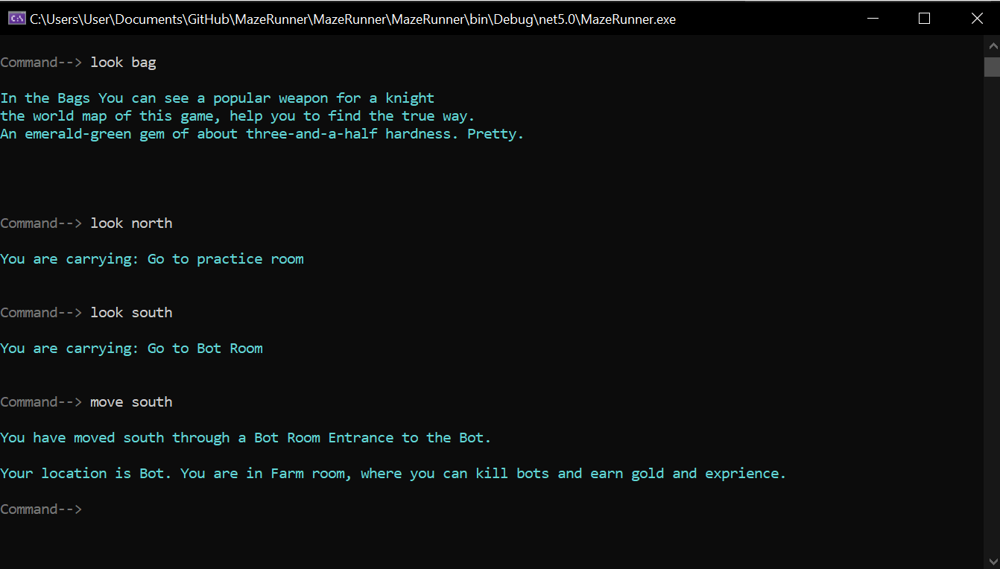

# MazeRunner
Welcome to the Maze, a text-based fantasy RPG where imagination shapes a rich world of heroes and Monsters. Choose your path, embrace courage as a hero, or wield darkness as a fearsome Monster. The Maze adapts to your choices, moulding a dynamic narrative. Unleash your creativity in this ever-evolving realm. The fate of this world lies in your hands. Will you become a legend or a creature of darkness? Step into the Maze and uncover a thrilling adventure like no other.

at this stage in the project, the base features of the program allow for most functions needed to operate the world. here are a few additions that could be implemented

Add World Generation
given the current implementation each user must manually design the world they wish to explore. The hope is to eventually build the world so it will generate new each time. add quests and objectives.

Add Quests
add random generation of quests and objectives with rewards

Add a Save Function
all users to save progress within the world
